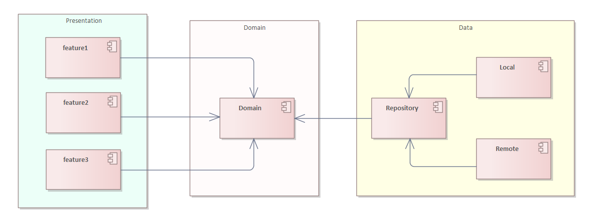
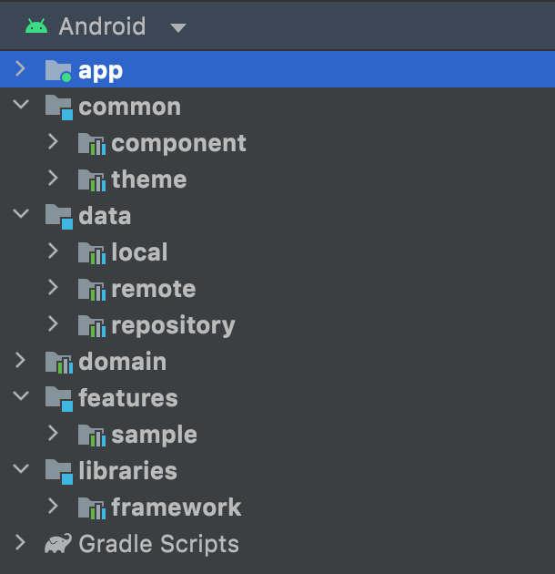

# Android Template

## Description

Clean architecture 기반의 프로젝트 구조와 Kotlin과 최신 기술 스택을 사용한 안드로이드 템플릿 프로젝트입니다.

Kotlin 사용하여 작업된 프로젝트로 Clean Architecture Principle, Feature module, Repository Pattern,
MVVM Architecture 및 Jetpack components에 따라 구현하였습니다.

## Setup

[android-gradle-plugin](https://github.com/ethanette/android-gradle-plugin/releases/tag/0.2.1) 프로젝트를 통한 Gradle 빌드 설정

## Architecture

## Layers

### Project Structure

### Common
`common` 레이어는 공통 모듈로 리소스 파일, 테마, 컴포넌트를 담당한다.

### Libraries
`libraries` 레이어는 기본 베이스 구조를 담당한다.

### Data
`Data` 레이어는 데이터를 관리하고 `Domain` 구현된 Repository 인터페이스에 대한 구현부를 제공합니다. `Data` 레이어는 네트워크 통신 및 데이터에 로컬 캐시하는 부분을 담당합니다

### Domain
`Domain` 레이어는 다른 레이어와 독립적입니다. 이를 통해 도메인 모델 및 비즈니스 로직을 다른 계층과 독립적으로 만들 수 있습니다. 즉, 다른 레이어의 변경
사항은 `Domain` 레이어에 영향을 미치지 않습니다. 데이터베이스(`Data` 레이어) 또는 화면 UI(`features` 레이어)를 변경해도
이상적으로는 `Domain` 레이어에서 코드가 변경되지 않습니다.

### Presentation
`features` 레이어는 사용자가 화면에서 보여지는 레이어입니다. 해당 레이어에는 views(activity, compose) and ViewModel이 포함됩니다.

# Tech Stacks
- [Gradle Kotlin DSL](https://gradle.org/kotlin/)
- [Gradle Version catalogs](https://docs.gradle.org/current/userguide/platforms.html#sub:version-catalog)
- [Custom Gradle Plugins](https://docs.gradle.org/current/userguide/custom_plugins.html)
- [Compose](https://developer.android.com/jetpack/compose)
- [Jetpack](https://developer.android.com/jetpack)
  - [Android KTX](https://developer.android.com/kotlin/ktx.html)
  - [AndroidX](https://developer.android.com/jetpack/androidx)
  - [Lifecycle](https://developer.android.com/topic/libraries/architecture/lifecycle)
  - [ViewModel](https://developer.android.com/topic/libraries/architecture/viewmodel)
  - [Room](https://developer.android.com/training/data-storage/room)
  - [Paging3](https://developer.android.com/topic/libraries/architecture/paging/v3-overview)
- [Accompanist](https://google.github.io/accompanist)
- [Dagger Hilt](https://dagger.dev/hilt/)
- [Retrofit](https://square.github.io/retrofit/)
- [Coroutines](https://github.com/Kotlin/kotlinx.coroutines)
- [Flow](https://developer.android.com/kotlin/flow)